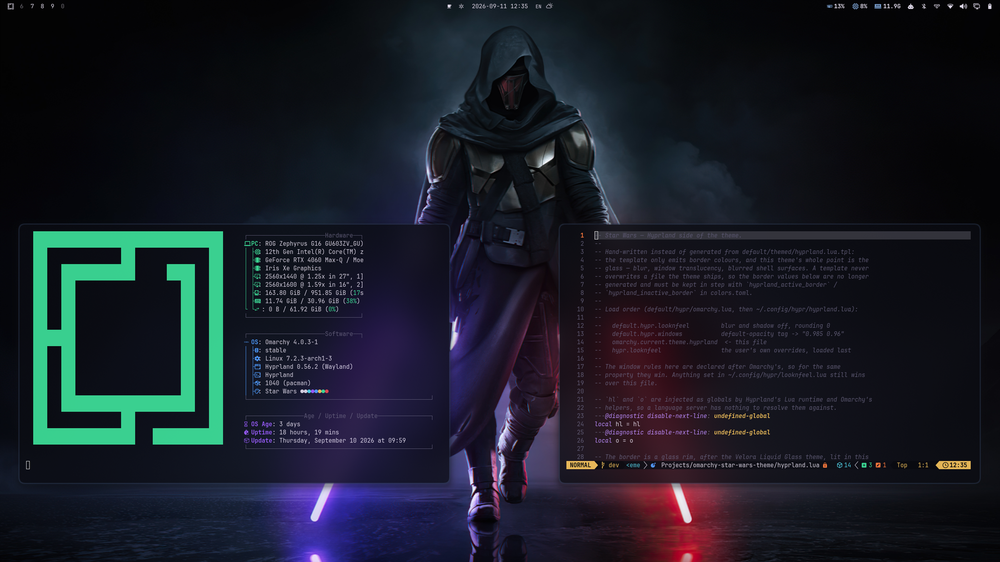

# Star Wars

An [Omarchy 4](https://omarchy.org/) theme built around a Sith lightsaber
wallpaper — navy-black smoke, one red blade, one violet blade — with frosted
glass everywhere: translucent windows, terminals, bar, menus and
notifications over a Hyprland blur.



## Install

```bash
ln -sfn "$PWD" ~/.config/omarchy/themes/star-wars
omarchy theme set star-wars
```

Use a symlink, not `omarchy theme install`. A theme cloned from a repo is
filtered: Omarchy drops every `*.lua` and the terminal configs from it, and
those are exactly the files that carry the blur and the terminal
transparency. A symlink skips that filter.

## Palette

| Role | Value | From |
|---|---|---|
| `background` | `#0d0e15` | the smoke field of the Sith wallpaper (`#11121b`), a step down |
| `dark_background` / `darker_background` | `#090a10` / `#050609` | one and two steps below |
| `lighter_background` | `#1b1c2b` | the violet haze in the smoke |
| `foreground` | `#dcd6e6` | the pale lavender rim light on the cloak |
| `accent` | `#7fa6d8` | the steel-blue smoke (`#626f90`), lifted |
| `selection` | `#26354f` | the smoke's mid tone (`#283646`), a step up |
| active border | pale steel `#cfe0f7` 40% -> accent `#7fa6d8` 18%, 90°; inactive smoke navy `#26354f` 50%; shell rims at 85% | a glass rim lit from above, after [Velora Liquid Glass](https://github.com/shoxjaxon-atabayev/omarchy-velora-liquid-glass) |
| `green` | `#3ddc97` | the stormtrooper's smoke |
| `orange` / `yellow` | `#ff7a3d` / `#f0c05a` | the Mandalorian's sparks |
| `blue` | `#4d9bff` | a Jedi blade |
| `magenta` | `#9b5cff` | the violet blade, a purer step |

## Glass

| What | Where | Setting |
|---|---|---|
| Blur | `hyprland.lua` | size 9, 3 passes, brightness 0.75, vibrancy 0.25 |
| Glass edge | `hyprland.lua` | rim border, superellipse corners (`rounding_power 3`), shadow offset 5 px down |
| App windows | `hyprland.lua` | opacity 0.90 active / 0.82 inactive |
| Terminals | `foot.ini`, `ghostty.conf`, `alacritty.toml`, `kitty.conf` | background alpha 0.72 + blur requested, window 1.0 / 0.94 |
| Bar | `shell.bar.toml` | `background` at 0.7 — the windows' hue, a step deeper; needs the bar's transparent mode off |
| Menu / launcher | `shell.menu.toml`, `shell.launcher.toml` | card 0.68 / 0.62, scrim 0.1 (unblurred), selected row in the accent |
| Notifications / popups | `shell.notifications.toml`, `shell.popups.toml` | 0.72 / 0.78 |
| Polkit / tooltip / lock field | `shell.polkit.toml`, `shell.tooltip.toml`, `shell.lock.toml` | 0.85 / 0.9 / 0.55 |
| GTK apps (Files…) | `gtk.css` | rgba surfaces |

The bar tint only applies while Omarchy's transparent-bar mode is off
(Omarchy Menu → Style → Bar → Transparency, or `omarchy-bar transparent
toggle`). With it on, the bar draws no background at all and shows the bare
top strip of the wallpaper — the darkest part of every image here — so it
reads near-black next to the frosted windows.

Terminals get alpha on the cell background rather than whole-window opacity,
so the text itself stays fully opaque. Each terminal config also asks for
blur: foot 1.28 speaks `ext-background-effect-v1`, and without `blur=yes`
it tells Hyprland not to blur behind it — translucent but sharp. Browsers, video players, games and
screen-share targets keep Omarchy's opaque rules.

Blur brightness 0.75 keeps text legible even over the bright
`nostalgic-room` wallpaper. For more see-through, lower the alpha values
above; for less, raise them.

`gtk.css` reaches GTK apps only through
`~/.config/gtk-4.0/gtk.css -> ~/.local/state/omarchy/current/theme/gtk.css`
(machine config, not part of the theme). GTK reads CSS at startup — restart
the app (`nautilus -q`) to repaint.

## Backgrounds

```
00-sith-star-wars-lightsaber-dark-background   <- default
kylo-ren-star-wars-the-rise-of-skywalker-black
nostalgic-room
star-wars-ahsoka-orrery                         (DevSviat's ink, see below)
star-wars-the-7680x4320
stormtrooper-star-wars-neon
```

Omarchy has no default-background key: on a first apply it takes the first
file in sort order, hence the `00-` prefix.

## Unlock screen

Omarchy Menu -> Style -> Unlock (the Plymouth boot splash and SDDM greeter)
uses `unlock.png`: the Ahsoka orrery exactly as the DevSviat theme draws it,
so the boot splash matches the Ahsoka wallpaper in the rotation. Both files
are byte-for-byte the DevSviat ones; `tools/generate-orrery.sh` rebuilds them
from the untouched source image, plus a `preview-unlock.png` that shows the
logo over this theme's own background — the flat fill Plymouth draws here.

## Liquid glass (optional hyprglass)

`hyprland.lua` carries a configuration block for the
[hyprglass](https://github.com/hyprnux/hyprglass) compositor plugin — edge
refraction, chromatic aberration and a specular sheen on windows, the bar, the
Omarchy menu and the bar panels. The block only runs when the plugin is
already loaded; without it the theme is unchanged. It follows the
[Velora Liquid Glass](https://github.com/shoxjaxon-atabayev/omarchy-velora-liquid-glass)
approach, with a softer preset of its own: `saber` inherits hyprglass's
`glass` but cuts refraction from 8.0 to 3.0, chromatic aberration from 0.5 to
0.15 and lens distortion from 0.3 to 0.12, with a thinner bezel — corners read
as rounded glass instead of a fisheye. The 0.55 alpha gate matches the blur
rules, so a menu's scrim never refracts.

Measured cost on this laptop (Hyprland on the RTX 4060, two high-res
monitors, 15 s per case, no other test windows open):

| Case | Hyprland CPU | GPU power |
|---|---|---|
| hyprglass off, idle | 1.1% | 9.0 W |
| hyprglass on, idle | 3.9% | 9.4 W |
| hyprglass on, a window redrawing at 30 Hz | 5.0% | 10.4 W |
| hyprglass off, a window redrawing at 30 Hz | 5.3% | 9.9 W |

That is with `live_resample` off for the shell layers (it re-rendered the
bar's glass on every clock tick and pushed idle CPU to 5.3%). What remains is
about 3% of one core and 0.5–1.5 W — small, but not free. GPU utilisation
swung too much between runs to quote. Unload it on battery if that matters.

The plugin must match the running Hyprland exactly. The prebuilt release links
against an older aquamarine, so build it locally:

```bash
git clone --depth 1 --branch v0.8.1 https://github.com/hyprnux/hyprglass ~/.local/share/hyprglass/src
make -C ~/.local/share/hyprglass/src
hyprctl plugin load ~/.local/share/hyprglass/src/hyprglass.so
hyprctl reload        # so the theme's hyprglass block runs
```

That loads it for the current session only. Rebuild after every Hyprland
update; a mismatched build refuses to load. To unload:
`hyprctl plugin unload ~/.local/share/hyprglass/src/hyprglass.so`.

## Animations

`hyprland.lua` replaces Omarchy's animation set with four curves:

| Curve | Feel | Used by |
|---|---|---|
| `ignite` | fast, slight overshoot — a blade snapping out | windows opening, special workspace |
| `retract` | eases in, then gone | windows closing, fade-outs |
| `glide` | long ease-out | moves, resizes, border colour, fades |
| `hyperspace` | slow start, hard jump, soft landing | workspace switches (slide + fade) |

Workspace switching is animated here, while Omarchy's defaults have it off.
The active/inactive opacity change fades, so focus moves smoothly across the
glass. The bar, the Omarchy menu and the bar panels keep Omarchy's own `no_anim`
rules: Hyprland can only move or scale a whole full-screen layer, so the
panels' motion belongs in the shell's QML, not in the theme. Anything in `~/.config/hypr/looknfeel.lua` still wins.

## Generated from `colors.toml`

Neovim (aether), btop, Chromium, Helix, Obsidian, VS Code (a local "Omarchy"
theme), the keyboard backlight (steel blue) and the rest come from
Omarchy's own templates. Icons are `Yaru-blue-dark`.

## tools/

| File | What it does |
|---|---|
| `generate-orrery.sh` | builds `unlock.png`, `preview-unlock.png` and the orrery wallpaper |
| `preview.html` + `generate-preview.sh` | renders `preview.png` with headless Chromium |
